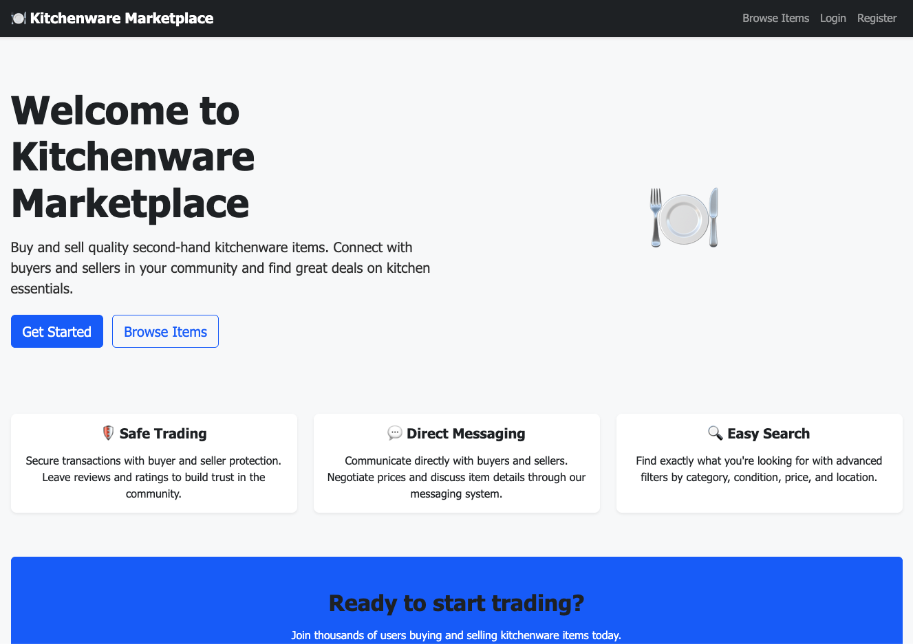

# 🍽️ Kitchenware Marketplace

A Django-based platform for buying and selling second-hand kitchenware items. Connect buyers and sellers in a trusted marketplace with user authentication, item listings, messaging, and transaction management.

## 📸 Site Preview




## 🌟 Features

### ✅ Completed (Phase 1)
- **Project Setup**: Complete Django project with PostgreSQL database
- **Base Templates**: Bootstrap 5 responsive design with navigation
- **Environment Configuration**: Secure settings management
- **Documentation**: Comprehensive setup and development guides

### ✅ Completed (Phase 2)
- **User Authentication**: Registration, login, logout with messages
- **User Profiles**: Profile creation, viewing, editing with full name, bio, phone
- **Seller Accounts**: Seller status, verification, ratings, sales tracking
- **Profile Management**: Edit profile, update picture, phone number, bio
- **Seller Directory**: Browse verified sellers, seller ratings
- **Form Validation**: Email/username uniqueness, phone format, image size
- **Permission System**: Login required, user can only edit own profile

### 🚧 In Development (Phase 3)
- **Marketplace CRUD**: Item listings with image upload
- **Search & Filtering**: Advanced item discovery
- **Messaging System**: Direct buyer-seller communication
- **Transaction Management**: Purchase tracking and reviews

## 🚀 Quick Start

### Prerequisites
- Python 3.8+
- PostgreSQL (optional - defaults to SQLite)
- Git

### Installation

```bash
# Clone the repository
git clone https://github.com/msiSibs/kitchenwareTradingSite.git
cd kitchenwareTradingSite

# Run the setup script
./setup.sh

# Create superuser
source venv/bin/activate
python3 manage.py createsuperuser

# Start the development server
python3 manage.py runserver
```

**Visit**: http://localhost:8000/ (Homepage) or http://localhost:8000/admin/ (Admin Panel)

## 📖 Documentation

- **[docs/GETTING_STARTED.md](docs/GETTING_STARTED.md)** - Complete setup guide (automated & manual)
- **[docs/PROJECT_OVERVIEW.md](docs/PROJECT_OVERVIEW.md)** - Project description and technical stack
- **[docs/PROJECT_STRUCTURE.md](docs/PROJECT_STRUCTURE.md)** - Directory layout and app organization
- **[docs/DEVELOPMENT_PLAN.md](docs/DEVELOPMENT_PLAN.md)** - Phase-by-phase implementation roadmap
- **[docs/PROJECT_FILES_EXPLANATION.md](docs/PROJECT_FILES_EXPLANATION.md)** - File-by-file reference guide
- **[docs/TESTS.md](docs/TESTS.md)** - Test suite documentation (36 passing tests)

## 🤝 Contributing

1. Fork the repository
2. Create a feature branch: `git checkout -b feature-name`
3. Make your changes and test thoroughly
4. Commit your changes: `git commit -am 'Add feature'`
5. Push to the branch: `git push origin feature-name`
6. Submit a pull request

### Development Guidelines
- Follow Django best practices
- Write descriptive commit messages
- Test your changes before submitting
- Update documentation as needed

## 📄 License

This project is licensed under the MIT License - see the [LICENSE](LICENSE) file for details.

## 🙋‍♂️ Support

- **Issues**: Report bugs and request features on GitHub
- **Documentation**: Check the `docs/` folder for detailed guides

---

**Built with ❤️ using Django**

*Kitchenware Marketplace - Connecting kitchen enthusiasts since 2025*